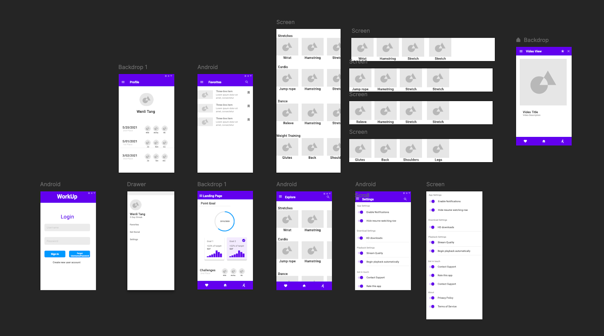

# WorkUp

**(CS5500, Northeastern University, Spring 2021)**

## Summary
As part of the coursework for Mobile Application Development, my teammates and I applied what we learned about Android Studio, FireDB, and multithreading to build a final semester project: an android application that promotes a more active lifestyle for sedentary users by completing short movements throughout the day. The project was written in Java and Android Studio.

## Protoyping
